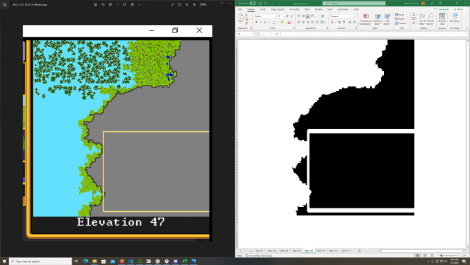

# Dwarf Fortress Screenshot to Map Tool

Reads a series of minimap screenshots for each elevation of a Dwarf Fortress embark,
identifies the underground sections,
and creates an Excel workbook showing the diggable areas (more or less) with one worksheet per elevation.
The workbook will have conditional formatting applied allowing you to copy/paste different values in the underground regions
(0 is white, 1 is black, and values outside that range will be uncolored).

The method isn't perfect, since the minimap has some JPEG-like compression artifacts around the borders of the underground regions,
but it should be pretty accurate and much quicker than mapping manually.

[][result.png]

## Installation

`pip install -r requirements.txt`

Currently uses:

- numpy
- opencv-python
- openpyxl
- scipy

## In Dwarf Fortress

Ideally, right after you start a new embark,
pause the game and take a series of screenshots at each map elevation that includes the entire minimap.
Start at either the highest elevation of interest and work your way down,
or from the lowest elevation of interest and work your way up.
Having some extra pixels around the minimap is ok, too --
the program should be able to crop out the title bar and GUI elements around the minimap.


## Screenshots folder

Organize your screenshots in this folder by world name and elevation, for example: `screenshots/Camade Oroni 1/*.png` for all screenshots taken of *Camade Oroni* game 1.
It shouldn't matter what the files are named, as long as they're PNG files.
Make sure their filenames are ordered by elevation, either ascending or descending.
If your screenshot tool includes a YYYY-MM-DD-HH-MM-SS style timestamp in the filenames (for example, Greenshot), that should be sufficient.

## Running

`python df-screenshot-to-map.py --help` for help. Currently shows:

```
usage: df-screenshot-to-map.py [-h] [--basedir BASEDIR] world elevation_start elevation_step embark_size

positional arguments:
  world              Folder in basedir containing minimap screenshots
  elevation_start    Elevation of first minimap screenshot
  elevation_step     Elevation step size (-1 for descending order, 1 for ascending order)
  embark_size        Embark map size (only square embarks supported currently)

options:
  -h, --help         show this help message and exit
  --basedir BASEDIR  Base directory containing folders with minimap screenshots (defaults to 'screenshots')
```

`python df-screenshot-to-map.py worldname elevation_start elevation_step embark_size`

For example, if you copy the PNGs from `examples` to `screenshots/Camade Oroni 1`:

`python df-screenshot-to-map.py "Camade Oroni 1" 70 -1 4`

## Examples

See the `examples` folder for some screenshots and resulting spreadsheet.

## TODO:

- Remove default 'Sheet' worksheet from workbook.
