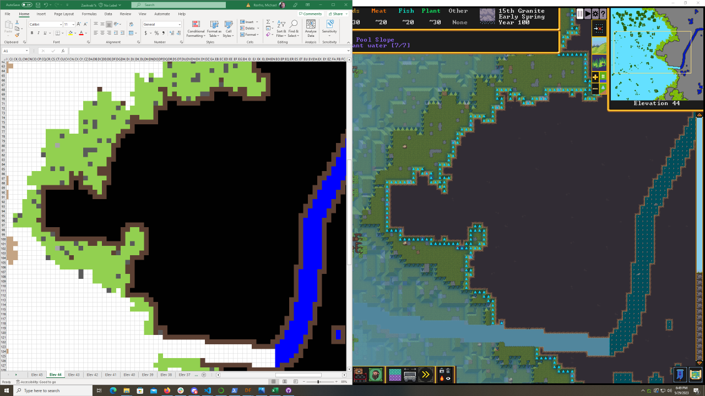

# Dwarf Fortress Elevations to Map Tool

Reads a series of text files for each elevation of a Dwarf Fortress embark,
and creates an Excel workbook showing the embark area's topography with one worksheet per elevation.
The workbook formats cell contents to differentiate various tile types (currently, bodies of water, trees, grass, plants, boulders, rock walls/ramps, soil walls/ramps, pebbles, and subterranean tiles).

This is a much better method than my first attempt that did a lot of image processing of screenshots, but does require use of [DFHack](https://docs.dfhack.org/) to create the text files.

[](map-export-combined.png)

## Installation

### Python script

`pip install -r requirements.txt`

Currently uses:

- openpyxl

### DFHack and Lua script

See [Installing DFHack](https://docs.dfhack.org/en/stable/docs/Installing.html) for instructions on how to install DFHack.

Copy `export-map.lua` to the DFHack scripts folder (in the Steam version, that's `Dwarf Fortress/dfhack-config/scripts`).

## In Dwarf Fortress

Ideally, right after you start a new embark with DFHack enabled,
pause the game and run `export-map` in DFHack.
By default, `export-map` will not show any fully subterranean elevations to reduce spoilers.
Run it as `export-map spoilers` to get exports from all elevations.
This will write a set of `map-exports/NAME_OF_FORTRESS/NAME_OF_FORTRESS-*.txt` files under the main Dwarf Fortress folder.

## `elevations` folder

Organize your text export files in this folder by world name, for example: `elevations/Quakevaults/Quakevaults-*.txt` for all text files from the **Quakevaults** embark.

## Running

`python df-map-export.py --help` for help. Currently shows:

```
usage: df-map-export.py [-h] [--basedir BASEDIR] [--zoom ZOOM] [--embark-elevation EMBARK_ELEVATION]
                        world

positional arguments:
  world                 Folder in basedir containing minimap screenshots

options:
  -h, --help            show this help message and exit
  --basedir BASEDIR     Base directory containing folders with minimap elevations (defaults to
                        'elevations')
  --zoom ZOOM           Spreadsheet zoom level (in percent, defaults to 25)
  --embark-elevation EMBARK_ELEVATION
                        Elevation of embark site (if specified, will set active sheet in Excel workbook)
```

For example, if you use the default text files in the `examples/elevations/Quakevaults` folder:

`python .\df-map-export.py --basedir examples/elevations Quakevaults --embark-elevation 46`

Or if you copy them to the `elevations` folder:

`python .\df-map-export.py Quakevaults --embark-elevation 46`

## Examples

See the `examples` folder for some elevation files and resulting spreadsheets.
